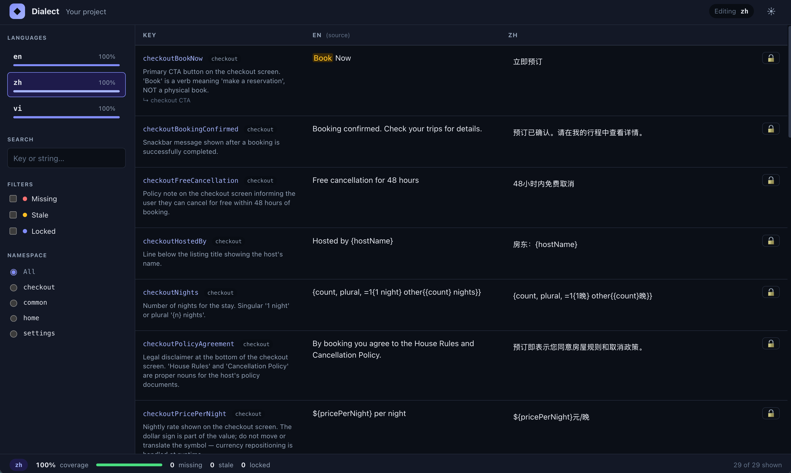

# Dialect

**AI-native localization for developers who already code with AI.**

---

Developers who code with AI already have the perfect translator sitting right next to them. When you just built a checkout screen in Flutter, your AI co-pilot has full context — the widget tree, the button semantics, the user flow. You can just say *"add the labels on this screen to translations and translate them into Spanish, Japanese, and Arabic"* and it should just work.

**Dialect** is a convention-first, open-source localization toolkit. One canonical source syncs translations across your Flutter app and backend services. The CLI is forever free and full-featured — no required dashboard, no context switching, just code. (An optional hosted dashboard at `dialect.tools` is coming in v1.3 for teams who want non-dev translators to review AI-generated translations — see [`docs/cloud.md`](docs/cloud.md).)

```
Dev (typing in AI chat session):
      "I just built the checkout screen. Translate the new strings
       into Spanish, Japanese, and Arabic."

AI:   *reads AGENTS.md → this project uses Dialect*
      *reads dialect/dialect.yaml + dialect/glossary.yaml — convention,
       target locales, glossary loaded*
      *reads lib/screens/checkout_screen.dart for context*
      *adds 12 keys to dialect/source/en.arb with @key.namespace and
       contextual @descriptions*
      *replaces hardcoded Text(...) with AppLocalizations.of(context)!*
      *translates to es, ja, ar respecting the glossary*
      *runs `dialect check --fix && dialect sync && dialect check`*
      ✓ Flutter ARB updated
      ✓ Backend JSON updated (icu-json)
      ✓ All 3 locales complete, placeholders match
```

One chat message. One source. Flutter + backend in sync. 60 seconds.

---

## Install

```bash
# macOS / Linux — official installer
curl -fsSL https://dialect.tools/install.sh | sh

# macOS / Linux — Homebrew
brew install ChauCM/tap/dialect

# Any platform — Dart pub
dart pub global activate dialect

# GitHub Actions
- uses: ChauCM/dialect@v1
  with:
    args: check --strict
```

Pre-built binaries for `macos-arm64`, `linux-x64`, and `windows-x64` are attached to every [release](https://github.com/ChauCM/dialect/releases). Verify the SHA-256 against the release's `SHA256SUMS` asset. Intel Macs and Linux ARM64 — [build from source](#build-from-source).

### Build from source

If you're on Intel macOS or Linux ARM64, the Homebrew formula and `install.sh` will refuse to install — there are no prebuilt binaries for those targets. Build the binary yourself; the Dart toolchain ships with Flutter so any Flutter dev already has what they need.

```bash
git clone https://github.com/ChauCM/dialect.git
cd dialect
dart pub get
cd dashboard && pnpm install && pnpm build && cd ..
dart run tool/build_dashboard.dart --no-pnpm
dart compile exe bin/dialect.dart -o build/dialect
sudo install -m 0755 build/dialect /usr/local/bin/dialect
dialect --version
```

---

## Usage

The dev never touches the terminal. Everything starts and ends in your AI agent (Claude Code, Cursor, Cline, Copilot…). The CLI is what your AI agent runs on your behalf.

### New project — one chat message

You have a Flutter app with hardcoded English strings. You want Spanish, Japanese, and Arabic in production. Open your AI agent in the project and paste:

```
Dev (typing in AI chat session):
      "run dialect init and follow the instructions.
       Target Spanish, Japanese, and Arabic."

AI:   Running `dialect init`...
      ✓ Scaffolded dialect/  → wrote dialect.yaml, glossary.yaml, en.arb
      ✓ Wrote .dialect/init-plan.md  (two-phase playbook)
      ✓ Created AGENTS.md  (so future sessions know about Dialect)

      Reading .dialect/init-plan.md — Phase 1: Setup.

      ✓ Added flutter_localizations + intl to pubspec.yaml
      ✓ Created l10n.yaml
      ✓ Wired MaterialApp.localizationsDelegates + supportedLocales
      ✓ Added a locale picker in the Settings screen
      ✓ Smoke test passed: commonLoading flows through AppLocalizations

      27 user-facing strings found under lib/. Proceeding to Phase 2
      (under the 50-string threshold — extract + translate in this same turn).

      ✓ Extracted 27 keys into dialect/source/en.arb with @key.namespace
        + @key.description for each
      ✓ Replaced hardcoded strings in lib/ with AppLocalizations.of(context)!
      ✓ Translated to {es, ja, ar} respecting dialect/glossary.yaml
      ✓ Ran `dialect check --fix && dialect sync && dialect check` — clean

      Done. Run `flutter pub get && flutter run`, switch locale via
      Settings → Language, and translated text renders immediately.
```

That's the whole adoption flow: **one chat message**. The AI runs `dialect init` itself, reads the plan Dialect emitted, and executes Phase 1 + Phase 2 end-to-end. You review the resulting diff and merge.

The init plan is two-phased to scale gracefully:
- **≤ 50 candidate strings** — the AI extracts + translates in one chat turn (the example above).
- **> 50 strings** — the AI does Phase 2 extraction only, summarizes the proposed key names, and asks you to confirm before translating. Saves you reviewing 500+ translation lines downstream of bad key names.

### Ongoing work — natural language

Once `dialect init` has run, your project root has an `AGENTS.md` telling every future agent session about Dialect. From then on, every translation ask is plain English:

```
Dev: "I just added a Profile screen. Translate the new strings."

AI:  Reading AGENTS.md → I see this project uses Dialect.
     Reading dialect/dialect.yaml + dialect/glossary.yaml...

     ✓ Extracted 8 new keys from lib/screens/profile_screen.dart
     ✓ Translated to {es, ja, ar} respecting glossary
     ✓ Replaced hardcoded strings with AppLocalizations.of(context)!
     ✓ Ran `dialect check --fix && dialect sync && dialect check` — clean
```

No re-onboarding. The convention file is the spec; the AGENTS.md is the pointer.

### Advanced — manual touchpoints (optional)

The whole CLI surface is still there if you want to drive a specific step yourself rather than let the AI chain everything:

<details>
<summary><code>dialect check</code> — validate without changing anything</summary>

```bash
$ dialect check

⚠ dialect/translations/ar.arb:14  glossary  Translation for `checkoutYourTripHeader` does not appear to use the glossary term "Trip" (expected "رحلة").
  hint: Glossary defines "Trip" → "رحلة" in `ar`. If this key uses "Trip"
        in a non-literal sense, add `"glossary_exempt": true` to the
        @key block in the source ARB.

! dialect check: 1 warning (warnings only — exit 0 in soft mode;
  run with --strict in CI)
```

Five structural rules + four semantic heuristics. Every issue has a `file:line` and a real remediation hint.
</details>

<details>
<summary><code>dialect sync</code> — regenerate platform files</summary>

```bash
$ dialect sync

✓ Wrote lib/l10n/app_en.arb
✓ Wrote lib/l10n/app_es.arb
✓ Wrote lib/l10n/app_ja.arb
✓ Wrote lib/l10n/app_ar.arb
```

Flutter `gen_l10n` picks these up directly. Backend `flat-json` & `icu-json` adapters ship today — `dialect sync` writes `<locale>.json` per the canonical spec contracts under [`dialect/spec/`](dialect/spec/). iOS / Android native string-file adapters are **not on the roadmap** — Flutter generates iOS/Android-compatible output via its own build; native string files matter only for edge cases like method channels, native plugins, and launch screens. See [`docs/roadmap.md`](docs/roadmap.md).

**Sync is non-destructive.** If a key was added straight to a generated file (`lib/l10n/app_en.arb`) and never round-tripped through the source, regenerating would silently delete it. `dialect sync` refuses instead — it writes nothing, lists the orphan keys, and offers two explicit choices:

```bash
$ dialect sync
✗ dialect sync: refusing to run — the generated output holds 2 key(s) that
  are not in your source (dialect/source/en.arb). Regenerating would delete them.
    …
  dialect sync --adopt   pull them (English + any translations) back into the
                         Dialect source, then sync
  dialect sync --prune   confirm the deletion and regenerate without them
```

`--adopt` is the recovery path — it restores the source string (with its `@key` metadata) **and** any translated values that lived only in the output, so nothing is lost. `--prune` is opt-in on purpose: it throws those strings away. `dialect sync --dry-run` reports the same drift with a non-zero exit, so CI catches a hand-edited output before it ships.
</details>

<details>
<summary><code>dialect serve</code> — local review UI for non-engineers</summary>

```bash
$ dialect serve

Dialect Review running at http://localhost:4077
Reading from: ./dialect/
```



Every key, every locale, side by side with `@description` context and glossary highlighting. Per-locale coverage in the sidebar, status pills (missing / stale / locked), explicit Save / Revert in the editor, light + dark themes. Lock human-reviewed translations to skip them on the next AI re-translate.
</details>

<details>
<summary><code>dialect status</code> — coverage snapshot</summary>

```bash
$ dialect status

┌────────┬──────────┬───────┬─────┬────────┐
│ Locale │ Coverage │ Stale │ New │ Locked │
├────────┼──────────┼───────┼─────┼────────┤
│ es     │    100%  │     0 │   0 │      0 │
│ ja     │    100%  │     0 │   0 │      0 │
│ ar     │     95.8% │     0 │   1 │      0 │
└────────┴──────────┴───────┴─────┴────────┘
```
</details>

<details>
<summary>CI gate on every PR</summary>

`.github/workflows/dialect.yml`:

```yaml
name: Dialect
on: [pull_request]
jobs:
  check:
    runs-on: ubuntu-latest
    steps:
      - uses: actions/checkout@v4
      - uses: ChauCM/dialect@v1
        with:
          args: check --strict
```

`--strict` promotes warnings to errors, so a missing placeholder, an orphan `@key` block, or a glossary violation fails the build.
</details>

---

## Backend support

Dialect emits JSON for backends in two flavors — pick one per platform in `dialect.yaml`:

- **[`icu-json`](dialect/spec/icu-json.md)** — preserves `{count, plural, …}` for stacks with an ICU runtime.
- **[`flat-json`](dialect/spec/flat-json.md)** — plain `{ "key": "value" }` for stacks without ICU.

```yaml
platforms:
  backend:
    output: api/locales/
    format: icu-json        # or flat-json
    namespaces: [common, backend]
```

Then point your stack's existing localization library at the output directory — callsites don't change:

| Stack | Integration | Surface |
|---|---|---|
| **ASP.NET (C#)** | ~30-line `JsonStringLocalizer` over `IStringLocalizer<T>`, reading Dialect's `icu-json`. Keeps `_localizer["checkoutBookNow"]` everywhere, no dependency. | Snippet (a `Dialect.AspNetCore` NuGet wrapping it is a planned nice-to-have) |
| **Node / Express / Fastify** | `i18next-fs-backend` reads flat-key JSON natively. ICU plurals via `intl-messageformat`. | ~10-line snippet |
| **Django** | Drop-in JSON catalog adapter; keep `_("checkoutBookNow")` callsites. | ~15-line snippet |
| **Flask / FastAPI** | Tiny middleware loads `<locale>.json` from `Accept-Language`; standard template-helper interface. | ~15-line snippet |
| **Go** | `go-i18n` consumes flat-key JSON natively and parses ICU plurals out of the box. | One-line config |

For each stack, [`docs/platforms-backend.md`](docs/platforms-backend.md) carries the full snippet — registration, ICU plural wiring, fallback behavior, and (for ASP.NET) the hand-rolled `JsonStringLocalizer` template if you can't add a dependency. The principle is **Backend Humility**: your backend keeps its native localization interface (`IStringLocalizer<T>`, `_()`, `i18n.Localize`), Dialect just swaps the backing store.

---

## Layout & command reference

```
your-project/
├── dialect/
│   ├── dialect.yaml           # Config + AI-readable convention
│   ├── source/
│   │   └── en.arb             # Canonical source strings (ARB format)
│   ├── translations/
│   │   ├── es.arb
│   │   ├── ja.arb
│   │   └── ...
│   └── glossary.yaml          # Project-specific terms for consistent AI translation
├── .dialect/                  # Gitignored. AI-pointer plan files land here.
└── lib/l10n/                  # `dialect sync` output (Flutter convention)
```

**Status** is the release a command shipped in. `in main, unreleased` means the
code is on `main` but not in a tagged binary yet; a bare version number with no
release behind it (v1.3, v1.5) is a plan, not a promise.

| Command | Description | Status |
|---|---|---|
| `dialect init` | Scaffold the `dialect/` directory | v1.0 |
| `dialect import` | AI-pointer flow: import existing ARBs into the convention | v1.0 |
| `dialect describe` | AI-pointer flow: backfill `@description` from callsites | v1.0 |
| `dialect sync` | Generate platform-specific files from canonical ARBs | v1.0 |
| `dialect check` | Validate completeness, correctness, and translation quality heuristics | v1.0 |
| `dialect status` | Coverage overview across locales | v1.0 |
| `dialect serve` | Local web UI for reviewing translations | v1.0 |
| `dialect translate` | AI-pointer flow: write a plan your agent executes to translate missing keys | v1.0 |
| `dialect translate --auto` | Call an LLM directly (BYO key) for CI, where no agent is in the loop | planned |
| `dialect publish` | Build a versioned bundle (manifest + per-locale JSON) and write it to a `local` target | in `main`, unreleased |
| `dialect pull` | Fetch a bundle from a `local` target into `dialect/translations/` (use in CI deploy scripts) | in `main`, unreleased |
| `dialect login` / `link` / `push` | Talk to `dialect-server` (Cloud or self-host) — see [`docs/cloud.md`](docs/cloud.md) | v1.3 |
| `dialect export` | Full project tarball for migration between Cloud / self-host / local | v1.3 |
| `dialect diff` | Show translation changes for PR review | v1.5 |

`publish` / `pull` upload to a `local` target today. S3/R2 upload is the next
slice — point `target: local` at a synced directory and use your own tooling
(`aws s3 sync`, `rclone`) until it lands.

---

## Documentation

| Document | Description |
|---|---|
| [Why Dialect](docs/thesis.md) | The problem with localization today and the insight behind Dialect |
| [Roadmap](docs/roadmap.md) | What's shipped, what's planned for v1.1 → v2.0+, and what's explicitly out of scope |
| [Architecture](docs/architecture.md) | File convention, CLI reference, config format, CI integration |
| [Dialect Cloud](docs/cloud.md) | Cloud (v1.3), self-host (v1.4), and OSS local-only — three modes, same protocol |
| [Frontend Platforms](docs/platforms-frontend.md) | Flutter primary. iOS / Android native and React / RN as edge cases. |
| [Backend Platforms](docs/platforms-backend.md) | ASP.NET, Node, Django, FastAPI, Go — format adapters and bundle-URL integration |
| [Flutter OTA](docs/ota.md) | Over-the-air protocol for the `dialect_ota` Flutter package — deferred to v2.0+ |

### Stable on-disk contracts (`dialect/spec/`)

These specify Dialect's versioned file formats. Backend localizer libraries (`Dialect.AspNetCore`, third-party adapters) target this contract; breaking changes require a major-version bump.

| Spec | Description |
|---|---|
| [`icu-json`](dialect/spec/icu-json.md) | Backend JSON output that preserves ICU plural/select expressions byte-identically |
| [`flat-json`](dialect/spec/flat-json.md) | Backend JSON output that strips ICU plural/select to a plain string (takes the `other` branch) |
| [`@key.source_hash`](dialect/spec/source_hash.md) | Source-value fingerprint that powers `dialect status` "stale" and the dashboard lock indicator |
| [`.dialect/state.json`](dialect/spec/state.md) | Soft-mode acknowledgement store for the `dialect check` rules |

---

## What Dialect is

Six things, in order of "what you touch":

1. **A convention.** An opinionated way to organize ARB files with rich `@description` / `@placeholders` / glossary metadata, plus a YAML config that doubles as an AI-readable instruction sheet. Any modern AI editor produces correct output by reading it.
2. **A CLI.** `init` scaffolds, `import` / `describe` write structured plan files the AI follows, `check` validates structurally and semantically, `sync` generates platform files, `status` reports coverage. **Forever free and full-featured.**
3. **A local review UI** (`dialect serve`). A Svelte SPA embedded in the binary; no `node_modules` at runtime. Side-by-side source + target, glossary highlighting, inline edit, pin/lock.
4. **Versioned on-disk contracts** ([`dialect/spec/`](dialect/spec/)). Backend localizer libraries target the spec, not the CLI version — breaking changes require a major bump.
5. **Dialect Cloud** ([planned v1.3](docs/cloud.md)). Optional hosted dashboard at `dialect.tools` for translator review without git access. Self-host comes in v1.4 — same binary, your infra.
6. **Flutter OTA** ([deferred to v2.0+](docs/ota.md)). Optional over-the-air translation updates for the `dialect_ota` Flutter package; reuses the v1.2 bundle format.

## Who Dialect is for

Small and medium teams who code with AI and want a localization workflow that lives in code, not a dashboard.

- You ship **Flutter + a backend** (ASP.NET, Node, Python, Go) and need cross-platform sync.
- You **already code with AI** — Claude Code, Cursor, Cline, Copilot — and want the same workflow for translation.
- You're **looking to move away** from a dashboard-centric TMS like Lokalise / Crowdin / Phrase, and don't need the enterprise pieces (translation memory, multi-step review, RBAC, audit trails).
- You'd rather own your translation files in git than rent a dashboard.

## License

[MIT](LICENSE)
